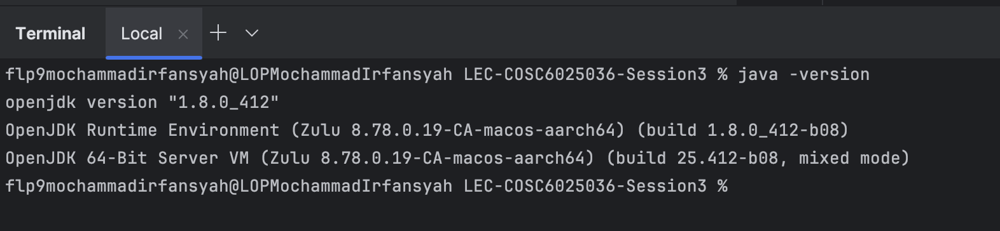

# Sistem Pengelola Data Mahasiswa (EduTech)

## LEC-COSC6025036-Session3 — Clone Guide
`git clone https://github.com/mirfnsyh-lecture/LEC-COSC6025036-Session3.git`

## Overview
**Nama:** Mochammad Irfansyah  
**NIM:** 2902715596  
**Mata Kuliah:** Data Structures and Algorithm Analysis  
**Tugas:** THEORY: Personal Assignment - Session 3

## Struktur Project

```
├── data/
│   └── mahasiswa.csv          # List data mahasiswa (nama, nim, jurusan, ipk)
├── src/
│   ├── Main.java              # Menu utama
│   ├── entity/
│   │   └── Mahasiswa.java     # Model mahasiswa (atribut, getter/setter, cekKelulusan, updateIpk, hitungPredikat)
│   ├── usecase/
│   │   ├── GetUseCase.java    # Show daftar mahasiswa (biasa / dengan Status + Predikat)
│   │   └── UpdateUseCase.java # Update IPK by NIM & simpan ke CSV
│   └── infrastructure/
│       └── CsvHelper.java     # Read/Write file CSV
├── Pembuktian Soal No. 1.png
├── Pembuktian Soal No. 2.png
└── Pembuktian Soal No. 3.png
```

## Fitur

| Menu | Deskripsi | Pembuktian |
|------|-----------|------------|
| **1. Show Data Mahasiswa** | Soal No. 1 Pembuatan Class dan Object |  |
| **2. Update IPK Mahasiswa** | Soal No. 2 Menerapkan Enkapsulasi dan Method |  |
| **3. Show Data Mahasiswa with Predicate** | Soal No. 3 Menentukan Predikat Akademik |  |
| **0. Shutdown** | Keluar dari program | — |

## Konsep OOP yang Diterapkan

- **Enkapsulasi:** 
  - Atribut `ipk` (dan lainnya) `private`.
  - Akses lewat getter/setter. Validasi IPK 0.0–4.0 di setter.
- **Method:** 
  - `tampilkanInfo()`.
  - `cekKelulusan()` (Lulus/Belum Lulus).
  - `updateIpk(double)`.
  - `hitungPredikat()` (predikat akademik).

## Format CSV

File `data/mahasiswa.csv` format:

```csv
nama,nim,jurusan,ipk
Andi Pratama,2440001,Teknik Informatika,3.75
...
```

Jalankan dari **root project** agar path `data/mahasiswa.csv` benar.

## Cara Menjalankan

**Menggunakan Make (dari root project):**

```bash
make run       # Compile dan jalankan Main
```

**Tanpa Make:**

```bash
mkdir -p build
javac -d build -sourcepath src src/entity/*.java src/infrastructure/*.java src/usecase/*.java src/Main.java
java -cp build Main
```

## Requirement

- JDK 8 atau lebih baru.
  
